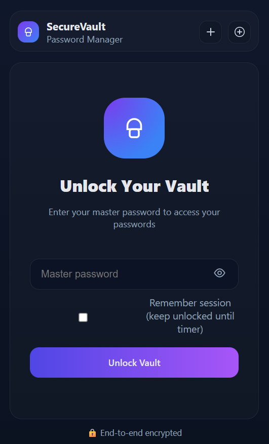
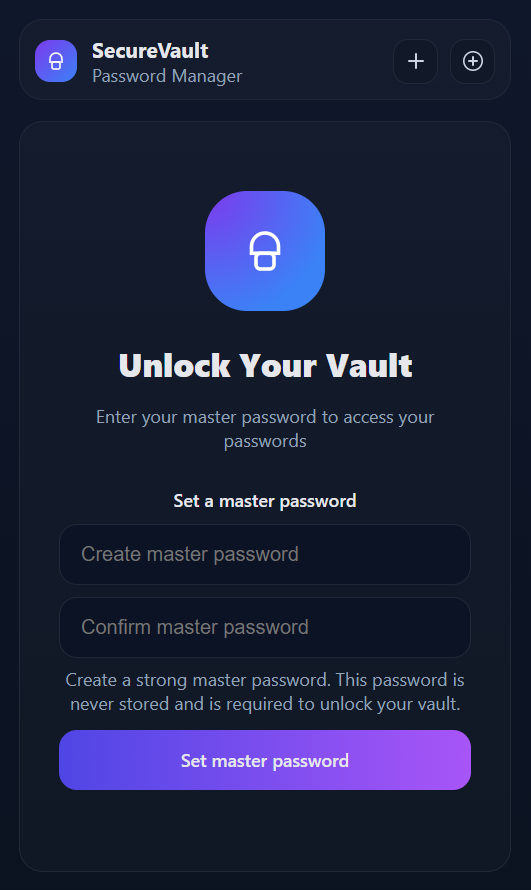

 SecureVault – Encrypted Password Manager

A lightweight Chrome extension that provides an end-to-end encrypted password manager. All encryption happens locally in your browser – ensuring that even if your data is leaked, it remains unreadable.

## ✨ Features

- **🔑 Master Password & Key Derivation**: Uses PBKDF2 to derive a strong AES-256 key from your master password (future-ready: can be extended to Argon2 or scrypt)
- **🛡️ Local Encryption**: Credentials are encrypted with AES-GCM before saving. The master password is never stored
- **📂 Vault Management**: Add, edit, delete, and search saved credentials securely
- **🔒 Auto-Lock**: Vault automatically locks after inactivity (configurable in settings)
- **🎨 Modern UI**: Built with clean HTML/CSS for a smooth, responsive interface
- **🌐 Autofill Support**: Content script detects login fields and can autofill stored credentials

## 📸 Screenshots

| Lock Screen | Vault Dashboard |
|-------------|-----------------|
|  |  |
| Create a Master Password | 🔒 Unlock with your master password | 📂 Manage credentials securely |

## 📁 Project Structure

```
SecureVault/
├── 📁 icons/                  # Extension icons & screenshots
│   ├── icon-128.png          # Main extension icon
│   ├── screenshot1.png       # Lock screen screenshot
│   └── screenshot2.png       # Dashboard screenshot
│
├── 📁 PopupUI/               # Frontend (popup + options pages)
│   ├── popup.html           # Main popup interface
│   ├── popup.js             # Popup logic
│   ├── options.html         # Settings page
│   ├── options.js           # Settings logic
│   ├── offscreen.html       # Offscreen document
│   └── offscreen.js         # Offscreen logic
│
├── 📁 src/                   # Core application logic
│   ├── background.js        # Service worker
│   ├── content.js           # Content script for autofill
│   ├── crypto.js            # Encryption/decryption functions
│   ├── db.js                # Local storage management
│   └── password.js          # Password utilities
│
├── styles.css               # Shared stylesheet
├── manifest.json            # Chrome extension manifest (v3)
└── README.md                # This documentation
```

## 🚀 Installation

1. **Clone the repository**
   ```bash
   git clone https://github.com/yourusername/SecureVault.git
   cd SecureVault
   ```

2. **Load into Chrome**
   - Open Chrome and navigate to `chrome://extensions/`
   - Enable "Developer mode" (toggle in top-right corner)
   - Click "Load unpacked" and select the SecureVault folder
   - Done! 🎉 The extension will appear in your Chrome toolbar

## 🛠️ Tech Stack

- **JavaScript** (ES6+)
- **Chrome Extensions API** (Manifest v3)
- **WebCrypto API** (PBKDF2 + AES-GCM encryption)
- **HTML5 & CSS3**

## 🔒 Security Model

SecureVault follows a zero-knowledge security model:

- ✅ **Master password is never stored** - Only you know it
- ✅ **PBKDF2-derived AES-256 key** encrypts all credentials
- ✅ **Local-only encryption** - All cryptographic operations happen in your browser
- ✅ **Chrome local storage** - Encrypted data stays on your device
- ✅ **Leak-proof design** - Even if data is compromised, attackers only see encrypted data

## 🎯 Usage

1. **First Time Setup**
   - Click the SecureVault icon in your toolbar
   - Create a strong master password
   - Your vault is ready!

2. **Adding Credentials**
   - Click "Add New" in the vault dashboard
   - Enter website, username, and password
   - Save securely

3. **Auto-fill**
   - Visit a login page
   - Click the SecureVault icon
   - Select the credential to auto-fill

4. **Security Settings**
   - Right-click extension icon → Options
   - Configure auto-lock timeout
   - Manage vault settings

## 🤝 Contributing

Contributions are welcome! Here's how you can help:

1. 🐛 **Report bugs** - Open an issue with details
2. 💡 **Suggest features** - Share your ideas
3. 🔧 **Submit PRs** - Fix bugs or add features
4. 📖 **Improve docs** - Help make documentation better

### Development Setup

```bash
# Clone the repo
git clone https://github.com/yourusername/SecureVault.git
cd SecureVault

# Make your changes
# Test in Chrome (load unpacked extension)
# Submit a pull request
```

## 🐛 Known Issues

- Extension currently supports Chrome only (Firefox support planned)
- Auto-fill may not work on all websites due to varying field structures

## 🗺️ Roadmap

- [ ] Firefox extension support
- [ ] Import/export functionality
- [ ] Password strength analyzer
- [ ] Two-factor authentication support
- [ ] Dark mode theme
- [ ] Argon2 key derivation option

## 📄 License

MIT License © 2025

Permission is hereby granted, free of charge, to any person obtaining a copy of this software and associated documentation files (the "Software"), to deal in the Software without restriction, including without limitation the rights to use, copy, modify, merge, publish, distribute, sublicense, and/or sell copies of the Software, and to permit persons to whom the Software is furnished to do so, subject to the following conditions:

The above copyright notice and this permission notice shall be included in all copies or substantial portions of the Software.

THE SOFTWARE IS PROVIDED "AS IS", WITHOUT WARRANTY OF ANY KIND, EXPRESS OR IMPLIED, INCLUDING BUT NOT LIMITED TO THE WARRANTIES OF MERCHANTABILITY, FITNESS FOR A PARTICULAR PURPOSE AND NONINFRINGEMENT.

## 🙏 Acknowledgments

- Thanks to the Chrome Extensions team for the robust API
- WebCrypto API for secure client-side encryption
- The open-source community for inspiration and feedback

---

**⚠️ Security Notice**: While SecureVault uses industry-standard encryption, always use strong, unique master passwords and keep your browser updated for maximum security.
